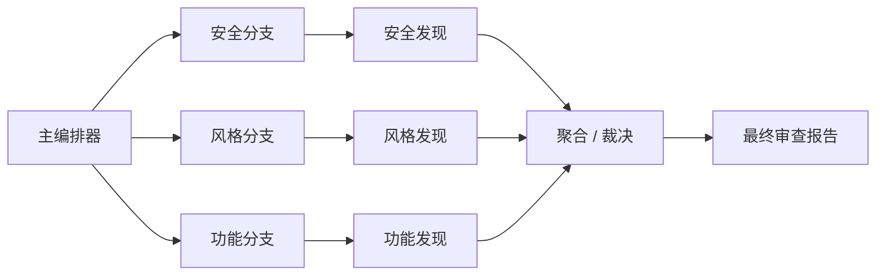

# AMI BIOS AI Review（中文版）

这个 skill 充当 AMI BIOS / Aptio 固件审查的“主编排器”。

当变更涉及 AMI Aptio、EDK II、Intel 平台固件、Setup、ACPI、构建元数据、
Flash 镜像组成、安全资产或混合固件目录树，并且审查质量依赖先识别文件类型时，
请使用这个 skill。

## 核心原则

先识别文件类型，再应用该类型对应的专业审查规则。

不要用一套笼统规则去审所有 BIOS 文件。

## 审查拓扑

审查流水线固定为：

`主编排器`
-> `安全分支` -> `安全发现`
-> `风格分支` -> `风格发现`
-> `功能分支` -> `功能发现`
-> `聚合 / 裁决`
-> `最终审查报告`

三个分支在概念上可以并行执行，再由聚合器统一合并。
如果同一个问题同时跨越多个分支，请保留一个主 finding，并记录次级标签。

## 输入要求

在做判断前，至少收集以下上下文：

- Diff 或变更文件列表
- 模块周边上下文
- 邻近元数据文件，如 `INF`、`DEC`、`DSC`、`SDL`、`CIF`、`DEPEX`
- 若涉及 UI / NVRAM，则要看 Setup 或字符串资源
- 若涉及 ACPI、Flash、Capsule、Boot Guard、TPM、签名，则要补对应安全上下文

如果变更引入了当前规则未明确覆盖的文件类型，请映射到最接近的审查族，并在报告中说明映射依据。

## 大 Diff / 大模块审查纪律

当 diff 很大、跨多个目录、或一次性引入整个模块时，不要把审查压缩成一句笼统总结。

应先按“审查面”拆分：

- 运行时代码和逻辑
- 模块元数据与依赖声明
- 构建集成、eLink、组件装配
- Setup、SMBIOS、ACPI、Flash 或外部接口暴露

执行规则：

- 每个发生变化的审查面都要显式看一遍
- 即使已经发现一个高优先级问题，也不能跳过其它变化面
- 每个“修复动作不同”的根因，通常都应保留为独立 finding
- 结论要说明“为什么问题会在集成时变成真实 bug”，而不只是指出某一行代码
- 对于“模块首次引入”提交，至少要检查：
  - 源码逻辑
  - `INF` / `DEPEX` / `DEC` / `DSC` 依赖与声明
  - `SDL` / `CIF` / eLink 注册
  - 当所需协议、PPI、库或外部资产缺失时，失败路径是否安全

覆盖率规则：

- 如果有多个审查面被修改，最终报告通常不应该只剩一条总括式 finding
- 如果某个变化面没有形成 finding，也应在 residual risks 或 cross-check 中提到该面已检查且暂无结论

## 文件类型路由

完整文件类型清单请参考：

- `E:\github\test_claude\test_claude\ami-bios-file-type-inventory.md`

路由分类如下：

- 固件源码：`C`、`H`、`CPP`
- 底层汇编：`ASM`、`S`、`NASM`、`ASM16`、`CSM16`、`INC`、`EQU`、`MAC`、`NASMB`
- EDK II 描述文件：`INF`、`DEC`、`DSC`、`DEPEX`、`UNI`、`VFR`
- AMI 构建 / 集成元数据：`SDL`、`CIF`、`MAK`、`SSP`、`SD`、`HFR`、`DXS`
- ACPI 与平台描述：`ASL`、`ASLC`
- 脚本与工具：`PY`、`BAT`、`SH`、`CMD`、`GAWK`
- 配置与数据表：`YAML`、`JSON`、`XML`、`MXML`、`INI`、`CNF`、`DEF`、`DAT`、`DT`、`ASI`、`MCB`、`CBIN`、`TXT`
- 二进制 / 镜像 / 信任资产：`FD`、`FV`、`FFS`、`EFI`、`BIN`、`ROM`、`RAW`、`LIB`、`DLL`、`EXE`、`SO`、`PDB`、`CER`、`PEM`、`KEY`、`ESL`、`SIGSTRUCT`

兼容性说明：

- `FDF`、`DSL`、`AML` 即使在当前仓库中不突出，也属于有效兼容类型
- 若后续审查中出现，应按 Flash 布局或 ACPI 产物处理

## 分支执行规则

### 安全分支

当变更可能影响以下内容时，读取 `references/security.md`：

- 内存安全
- 寄存器访问与硬件信任边界
- Boot Guard、Secure Boot、Capsule、TPM、ACM、签名资产或密钥
- SEC、PEI、DXE、SMM、MM 等特权阶段
- 脚本执行、打包、二进制来源

### 风格分支

当变更可能影响以下内容时，读取 `references/style.md`：

- AMI / EDK II 编码风格与可维护性
- 命名、Token 声明、PCD 使用、eLink 和模块声明
- Setup 文本清晰度、宏可读性、平台族一致性

### 功能分支

当变更可能影响以下内容时，读取 `references/functional.md`：

- 启动流程与初始化时序
- Protocol / PPI 绑定
- Setup 变量绑定与用户可见行为
- 构建与平台集成
- Flash 组成、配置表、ACPI 行为

### 聚合 / 裁决

在产出最终报告前，始终读取 `references/aggregator.md`。

## 严重级别

使用四级严重度：

- `P0` 严重：可导致启动损坏、信任边界失守、Flash 损坏、明确高危安全风险
- `P1` 高：高概率功能回归、权限边界问题、重大集成缺陷
- `P2` 中：真实的正确性、兼容性、可维护性问题
- `P3` 低：低风险清晰度、一致性、卫生类问题

优先给出“可以自圆其说的最高严重度”，但不要把纯风格问题拔高去和功能 / 安全问题抢优先级。

## 最终报告契约

最终报告必须先列 findings，并按严重度排序。

每条 finding 必须包含：

- 文件类型分类
- 风险类别
- 问题描述
- 为什么它在 AMI BIOS 场景下重要
- 值得联动复核的邻近文件或元数据

如果没有问题，输出 `No findings`，然后简要写出 residual risks 或 validation gaps。

## 审查默认倾向

- 优先看行为、风险和集成，而不是纯表面格式
- 优先升级跨文件不一致，而不是只盯某一行
- AMI 特有元数据要当成一等输入，而不是“构建噪音”
- 风格和安全 / 功能冲突时，以安全和功能为准
